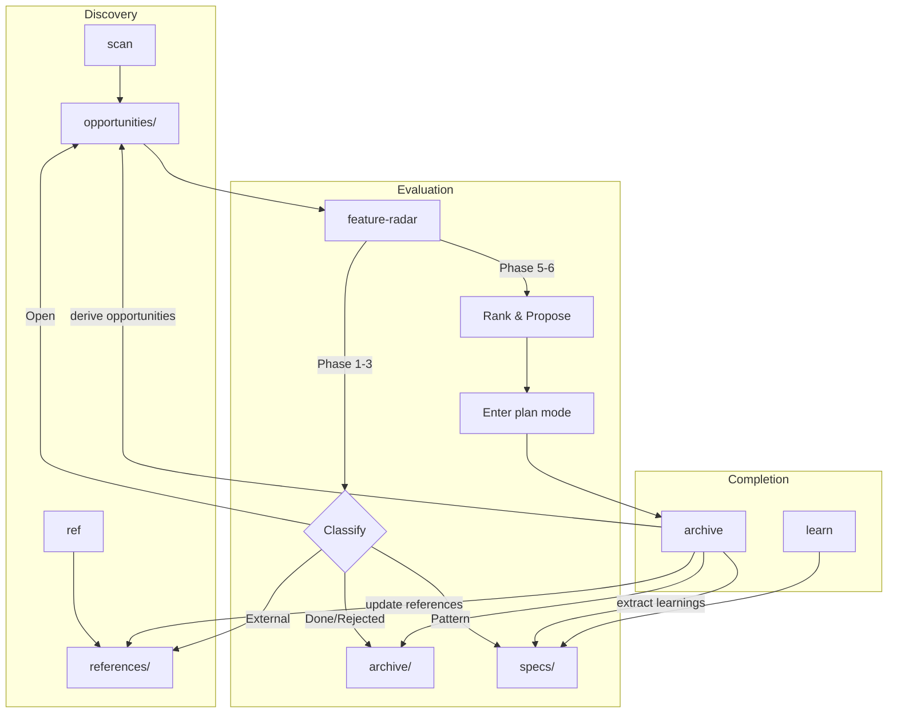
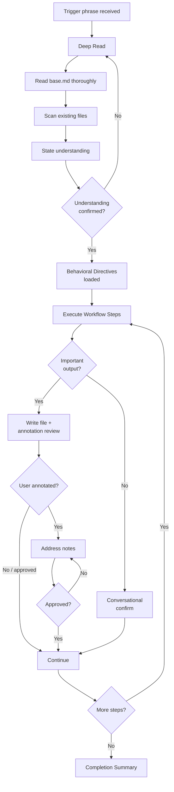

# Feature Radar

Feature Radar helps your AI coding agent discover, track, and prioritize what to build next.

Whether it's creative ideation, ecosystem scanning, user feedback, or cross-project research — it captures ideas from any source, evaluates them objectively, and maintains a living knowledge base that compounds over time.

Works with any AI agent that supports [SKILL.md](https://github.com/anthropics/claude-code/blob/main/docs/skills.md).

## How It Works

Say "feature radar" and your agent analyzes your project — language, architecture, key feature areas — and builds a structured tracking system at `.feature-radar/`. From there, every feature goes through a lifecycle:



**Archiving is not the end — it's a checkpoint.** Every shipped feature produces learnings, reveals new gaps, and opens new directions. The archive checklist enforces this so institutional knowledge compounds instead of evaporating.

The skills trigger automatically — just say "what should we build next" or "this feature is done" and the right workflow kicks in.

## How Skills Execute

Every skill follows the same execution model — deep understanding before action, structured checkpoints during execution, and verified completion:



### Annotation Cycle

You can steer any skill's output by annotating files directly:

1. The skill writes a file (e.g., `opportunities/07-streaming.md`)
2. Open the file, add `> NOTE: your correction` anywhere
3. Tell the agent "address my notes"
4. The agent reads all `> NOTE:` lines, applies corrections, removes markers
5. Repeat until satisfied

This is the fastest way to inject domain knowledge the agent doesn't have — architecture constraints, naming conventions, strategic decisions.

## Installation

### With [skillshare](https://github.com/runkids/skillshare)

```bash
skillshare install runkids/feature-radar --into feature-radar
```

### With [Vercel Skills CLI](https://github.com/vercel-labs/skills)

```bash
npx skills add runkids/feature-radar
```

### Manual

Copy the skills to your agent's skill directory:

```bash
# Claude Code
cp -r skills/* ~/.claude/skills/

# Codex
cp -r skills/* ~/.codex/skills/
```

Pick individual skills if you don't need all of them:

```bash
cp -r skills/feature-radar ~/.claude/skills/
cp -r skills/feature-radar-archive ~/.claude/skills/
```

## Skills Library

| Skill | Trigger | Output |
|-------|---------|--------|
| **feature-radar** | "feature radar", "what should we build next" | Full 6-phase workflow → all directories + base.md |
| **feature-radar:scan** | "scan opportunities", "brainstorm ideas" | New entries → `opportunities/` |
| **feature-radar:archive** | "archive feature", "this feature is done" | Move to `archive/` + extraction checklist |
| **feature-radar:learn** | "extract learnings", "capture what we learned" | Patterns → `specs/` |
| **feature-radar:ref** | "add reference", "interesting approach" | Observations → `references/` |

### feature-radar

The full workflow. Analyzes your project, creates `.feature-radar/` with `base.md` (project dashboard), then runs 6 phases: scan, archive, organize, gap analysis, evaluate, propose. Ends by recommending what to build next. Starts with deep project analysis and confirms understanding before proceeding. Checkpoints after Phase 1, 3, and 5 let you steer mid-flow.

### feature-radar:scan

Discover new ideas — from creative brainstorming, user pain points, ecosystem evolution, technical possibilities, or cross-project research. Deduplicates against existing tracking and evaluates each candidate on 6 criteria including value uplift and innovation potential. Deeply reads existing tracking state to avoid duplicates. After creating files, offers annotation review so you can refine Impact/Effort/Position.

### feature-radar:archive

Archive a shipped, rejected, or covered feature. Then runs the mandatory extraction checklist: extract learnings → specs, derive new opportunities, update references, update trends. Does NOT skip steps. After creating the archive file, offers annotation review before running the extraction checklist.

### feature-radar:learn

Capture reusable patterns, architectural decisions, and pitfalls from completed work. Names files by the pattern, not the feature that produced it. Confirms each finding with you before writing to specs/.

### feature-radar:ref

Record external observations and inspiration — ecosystem trends, creative approaches from other projects, research findings, user feedback. Cites source URLs and dates, assesses implications, suggests new opportunities when unmet needs or innovation angles are found. Confirms impact assessment with you before writing.

## What Gets Generated

On first run, `feature-radar` creates:

```
.feature-radar/
├── base.md           ← Project dashboard: context, feature inventory, strategic overview
├── archive/          ← Shipped, rejected, or covered features
├── opportunities/    ← Open features ranked by impact and effort
├── specs/            ← Reusable patterns and architectural decisions
└── references/       ← External inspiration, observations, and ecosystem analysis
```

**base.md** is the project dashboard — generated by analyzing your codebase, updated incrementally:

- **Project Context** — language, architecture, key feature areas, core philosophy
- **Feature Inventory** — what's built, where the code lives, docs coverage gaps
- **Tracking Summary** — counts across all categories
- **Classification Rules** — how features move between categories
- **Archive Extraction Checklist** — the mandatory checks that make knowledge compound

## Philosophy

- **Compound knowledge** — Every completed feature feeds back into the system
- **Value-driven** — Chase user value and innovation, not feature checklists
- **Honest evaluation** — Evaluate fit with YOUR architecture and users, not someone else's roadmap
- **Signal over noise** — 1 issue with no comments = weak signal; multiple independent asks = strong
- **Evidence over assumptions** — Rank by real demand and creative potential, not hypothetical value

## Contributing

Skills live in the `skills/` directory. To contribute:

1. Fork the repository
2. Create a branch for your skill
3. Add your skill under `skills/{skill-name}/SKILL.md`
4. Submit a PR

## License

MIT License — see LICENSE file for details.
