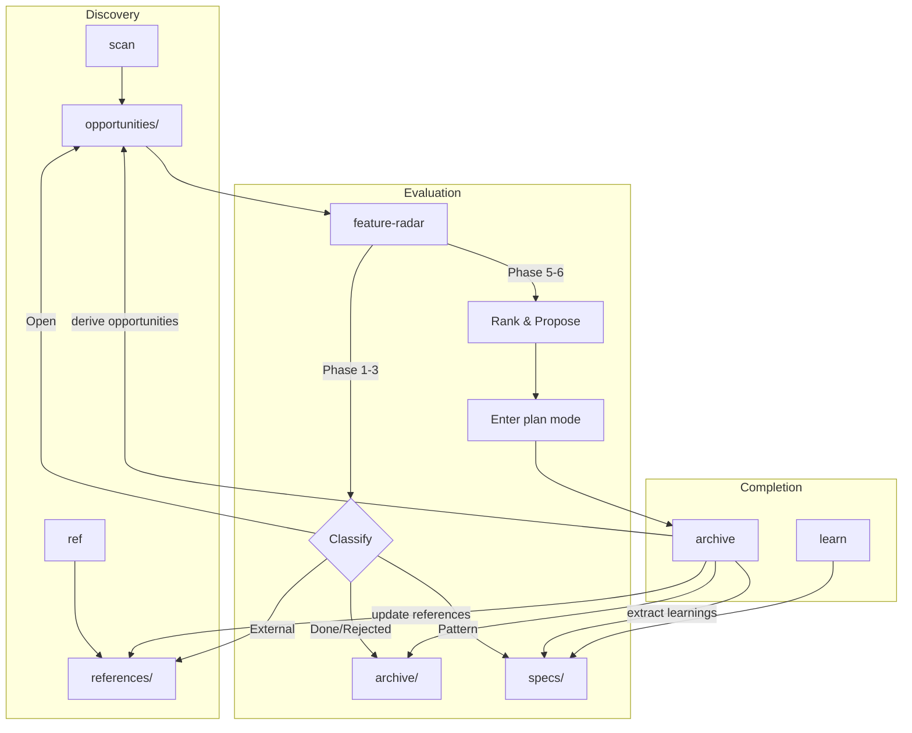
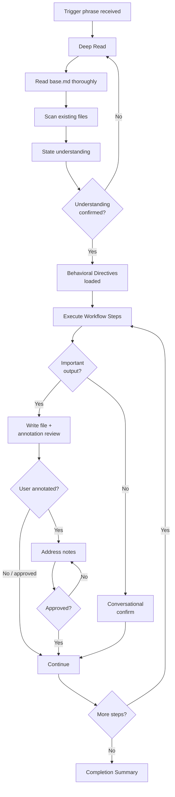

# Feature Radar

**Give your AI agent long-term memory and decision-making ability for feature planning.**

Your AI agent is great at writing code. But ask it "what should we build next?" and it gives you generic suggestions — it doesn't remember last week's architecture decisions, doesn't know which features you already rejected, and can't connect the dots between user feedback and technical possibilities.

Feature Radar fixes this. It creates an external brain (`.feature-radar/`) that persists across sessions — so your agent accumulates knowledge instead of starting from zero every time.

## Before / After

**Before Feature Radar:**
> You: "What should we build next?"
>
> Agent: "You could add dark mode, improve performance, or add user authentication..." *(generic suggestions that ignore your project's context)*

**With Feature Radar:**
> You: "feature radar"
>
> Agent: "Based on `base.md`, your project is a CLI tool focused on local-first workflow. I found 3 features you've already shipped that aren't documented, 2 open opportunities with high user demand, and a pattern from `archive/` suggesting your streaming approach needs rethinking. I recommend building the plugin system next — it has the highest impact-to-effort ratio and aligns with your architecture."

The difference? Your agent now has **context that compounds over time**.

## The Magic: Steer Your Agent with Annotations

The fastest way to inject your domain knowledge:

```
1. Say "feature radar" → agent generates opportunities
2. Open any file, add:  > NOTE: this is too complex, split into two phases
3. Say "address my notes"
4. Agent reads your notes, applies corrections, removes markers
5. Repeat until perfect
```

Your agent learns from your corrections. Architecture constraints, naming conventions, strategic priorities — all captured in files that persist forever.

## Quick Start

### With [skillshare](https://github.com/runkids/skillshare)

```bash
skillshare install runkids/feature-radar --into feature-radar
```

### With [Vercel Skills CLI](https://github.com/vercel-labs/skills)

```bash
npx skills add runkids/feature-radar
```

### Manual

```bash
# Claude Code
cp -r skills/* ~/.claude/skills/

# Codex
cp -r skills/* ~/.codex/skills/
```

Then say **"feature radar"** in your next session. That's it.

You can also say **"feature radar quick"** for a fast scan, **"feature radar evaluate"** to jump to prioritization, or **"feature radar #2"** to deep-dive a specific opportunity.

## What Happens Under the Hood

Your agent analyzes your project — language, architecture, key features — and builds a structured knowledge base:

```
.feature-radar/
├── base.md           ← Project dashboard: what you've built, where you're going
├── archive/          ← Shipped, rejected, or covered features (with extracted learnings)
├── opportunities/    ← Open features ranked by impact and effort
├── specs/            ← Reusable patterns and architectural decisions
└── references/       ← External inspiration, ecosystem trends, research
```

The data format is defined in [`SPEC.md`](skills/feature-radar/references/SPEC.md) — a language-agnostic specification that any AI tool can implement.

Every feature goes through a lifecycle — discovered, evaluated, built, archived. And every archived feature feeds back into the system:


```mermaid
flowchart TD
    subgraph Discovery
        S1["scan"] --> OPP[opportunities/]
        S2["ref"] --> REF[references/]
    end

    subgraph Evaluation
        FR["feature-radar"] --> |Phase 1-3| CLASSIFY{Classify}
        CLASSIFY --> |Open| OPP
        CLASSIFY --> |Done/Rejected| ARC[archive/]
        CLASSIFY --> |Pattern| SPEC[specs/]
        CLASSIFY --> |External| REF
        FR --> |Phase 5-6| RANK[Rank & Propose]
        RANK --> BUILD["Enter plan mode"]
    end

    subgraph Completion
        DONE["archive"] --> ARC
        DONE --> |extract learnings| SPEC
        DONE --> |derive opportunities| OPP
        DONE --> |update references| REF
        S3["learn"] --> SPEC
    end

    OPP --> FR
    BUILD --> DONE
```

**Archiving is not the end — it's a checkpoint.** Every shipped feature produces learnings, reveals new gaps, and opens new directions. Knowledge compounds instead of evaporating.

## Skills Library

Just say the trigger phrase — the right workflow kicks in automatically.

| Skill | Say this | What happens |
|-------|----------|-------------|
| **feature-radar** | "feature radar", "what should we build next" | Full 6-phase analysis: scan → archive → organize → gap analysis → evaluate → propose |
| **scan** | "scan opportunities", "brainstorm ideas" | Discover new ideas from multiple sources → `opportunities/` |
| **archive** | "archive feature", "this feature is done" | Move to `archive/` + mandatory learning extraction |
| **learn** | "extract learnings", "save this decision" | Capture patterns & decisions → `specs/` |
| **ref** | "add reference", "interesting approach" | Record external observations → `references/` |
| **validate** | "validate", "check format", "lint skills" | Validate SKILL.md frontmatter + `.feature-radar/` files against format rules |

<details>
<summary><strong>Skill details</strong></summary>

### feature-radar (main workflow)

The full 6-phase workflow. Analyzes your project, creates `.feature-radar/` with `base.md` (project dashboard), then runs: scan, archive, organize, gap analysis, evaluate, propose. Checkpoints after Phase 1, 3, and 5 let you steer mid-flow.

**Modes** — pass an argument to run a subset of phases:

| Argument | What it does |
|----------|-------------|
| *(none)* or `full` | All 6 phases (default) |
| `quick` | Phases 1-3 only — fast scan + archive + organize |
| `evaluate` | Phases 5-6 only — prioritize existing opportunities |
| `#N` (e.g. `#2`) | Deep-dive a single opportunity — evaluate + propose |

### scan

Discover new ideas — from creative brainstorming, user pain points, ecosystem evolution, technical possibilities, or cross-project research. Evaluates each candidate on 6 criteria including value uplift and innovation potential. Deduplicates against existing tracking.

### archive

Archive a shipped, rejected, or covered feature. Then runs the mandatory extraction checklist: extract learnings → specs, derive new opportunities, update references, update trends. This is where knowledge compounds — the checklist ensures nothing gets lost.

### learn

Capture reusable patterns, architectural decisions, and pitfalls from completed work. Names files by the pattern (e.g., `yaml-config-merge.md`), not the feature that produced it.

### ref

Record external observations — ecosystem trends, creative approaches, research findings, user feedback. Cites sources and dates, assesses implications, suggests new opportunities when relevant.

### validate

Checks SKILL.md frontmatter (description ≤ 1024 chars, kebab-case name) and `.feature-radar/` files against SPEC.md format rules. Reports errors and warnings, then auto-fixes what it can. Runs proactively after any edit to skills or `.feature-radar/` files.

</details>

## How Skills Execute

Every skill follows the same model — deep understanding before action, structured checkpoints, verified completion:


```mermaid
flowchart TD
    A[Trigger phrase received] --> B[Deep Read]
    B --> B1[Read base.md thoroughly]
    B1 --> B2[Scan existing files]
    B2 --> B3[State understanding]
    B3 --> C{Understanding<br/>confirmed?}
    C -->|No| B
    C -->|Yes| D[Behavioral Directives<br/>loaded]
    D --> E[Execute Workflow Steps]
    E --> F{Important<br/>output?}
    F -->|Yes| G[Write file +<br/>annotation review]
    F -->|No| H[Conversational<br/>confirm]
    G --> I{User annotated?}
    I -->|Yes| J[Address notes]
    J --> K{Approved?}
    I -->|No / approved| L[Continue]
    K -->|No| J
    K -->|Yes| L
    H --> L
    L --> M{More steps?}
    M -->|Yes| E
    M -->|No| N[Completion Summary]
```

## Philosophy

- **Compound knowledge** — Every completed feature feeds back into the system. Learnings accumulate, patterns emerge, decisions are remembered.
- **Value-driven** — Chase user value and innovation, not feature checklists. Ask "what problem does this solve?" before "what does this do?"
- **Honest evaluation** — Evaluate fit with YOUR architecture and users, not someone else's roadmap.
- **Signal over noise** — 1 issue with no comments = weak signal. Multiple independent asks = strong signal.
- **Evidence over assumptions** — Rank by real demand and creative potential, not hypothetical value.

## Works With

Any AI agent that supports [SKILL.md](https://github.com/anthropics/claude-code/blob/main/docs/skills.md) — Claude Code, Codex, and others.

## Contributing

Skills live in the `skills/` directory. Fork, branch, add your skill under `skills/{skill-name}/SKILL.md`, and submit a PR.

## License

MIT License — see LICENSE file for details.
